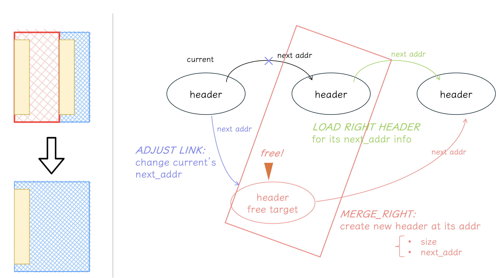
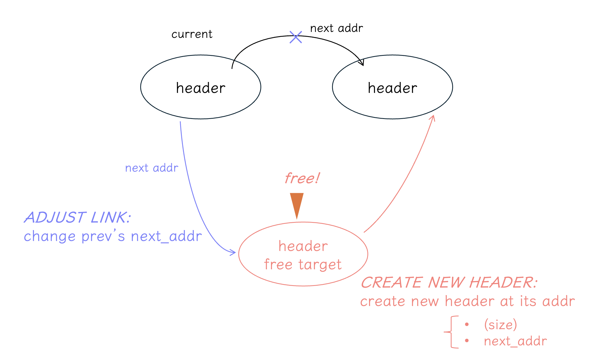
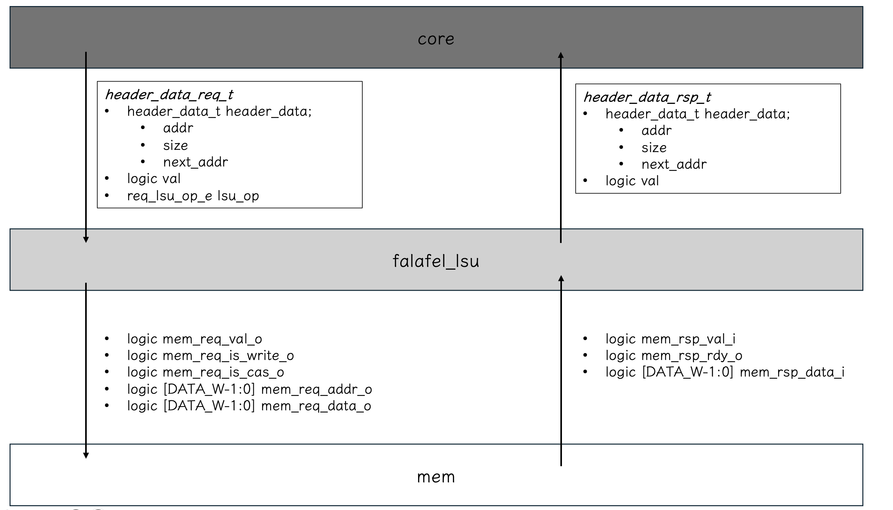
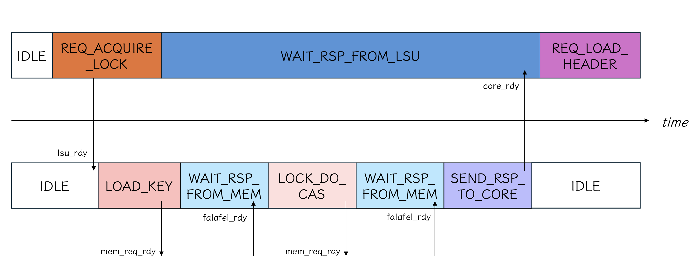
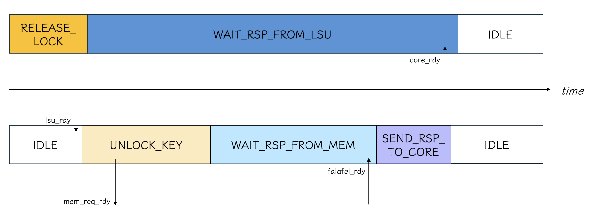
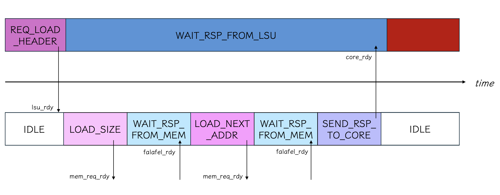

# Falafel v2 document <!-- omit in toc -->
last update: Nov 30, 2024

- [Quick Usage](#quick-usage)
  - [configs](#configs)
- [Document](#document)
  - [terms](#terms)
  - [mechanisms](#mechanisms)
    - [alloc](#alloc)
    - [free](#free)
  - [modules](#modules)
    - [falafel\_core](#falafel_core)
      - [states](#states)
    - [falafel\_lsu](#falafel_lsu)
      - [states](#states-1)
  - [interfaces \& interactions between core, lsu and mem](#interfaces--interactions-between-core-lsu-and-mem)

## Quick Usage
### configs
under construction
 

## Document
### terms
- [header](#header):  
Falafel v2 uses a linked list structure for managing its free list;  
The header contains the header located at the beginning of each free block; the size of the free block & the address of the next header address  

<!-- - header_data:  
the data in the header (block size & next address) + the address of the header
- [insert / delete header](#insert_delete)
 -->

 ### mechanisms
 #### alloc
 0. provide the alloc request and the memory size to allocate
 1. acquire lock 
 2. find a fitting location from the free block  
    → allocation strategies
    - **first fit** (supported):   falafel v2 goes through the linked list of free blocks from the start and searches for the first block of memory that is large enough to satisfy the allocation request
    - **best fit** (supported):   falafel v2 goes through the entire linked list of free blocks to find the smallest block of memory that is large enough, aiming to minimize wasted space.
 3. update the linked list of free blocks
    
   
 #### free
  0. provide the free request and the memory size to allocate
  1. acquire lock 
  2. find a proper block to free   ※ the linked list of free blocks is sorted in ascending order of memory addresses
  3. update the linked list of free blocks
     1. load the header of the block to be freed (to retrieve the size information)
     2. check if there are neighboring free blocks to the block to be freed
     3. the process varies depending on how free blocks are merged
        - case of a **right** neighbor free block  
            
        - case of a **left** neighbor free block
            
        - case of **both** neighbors being free blocks
            
        - case of **no** neighboring free blocks
            

### modules
#### falafel_core
the part responsible for the alloc & free strategies

##### states
I recommend starting with the [mechanisms section](#mechanisms) first :)
 

※　a request to the lsu occurs in the `REQ_*` states  
※　falafel_core can only receive a response from lsu in the `WAIT_RSP_FROM_LSU` state.

- `IDLE`
- `REQ_ACQUIRE_LOCK`: 
    request lock;  
    if the allocator acquire the lock, then it can move to starting the process of its memory allocating
- `REQ_RELEASE_LOCK`:
    release lock after the process of memory allocating
- `REQ_LOAD_HEADER`:
  - `SEARCH`: load header for position searching in alloc & free
  - `FREE_TARGET_HEADER`
  - `FREE_RIGHT_HEADER`
- `ALLOC_SEARCH_POS`: find a fitting location from the free block; first fit or best fit
- `FREE_SEARCH_POS`: find a proper block to free
- `FREE_CHECK_NEIGHBORS`: check if there are neighboring free blocks to the block to be freed
- `REQ_ADJUST_ALLOCATED_HEADER`
- `REQ_FREE_MERGE_BOTH_SIDES`
- `REQ_FREE_MERGE_RIGHT_HEADER`
- `REQ_FREE_MERGE_LEFT_HEADER`
- `REQ_CREATE_NEW_HEADER`
- `REQ_ADJUST_LINK`
- `WAIT_RSP_FROM_LSU`

#### falafel_lsu
the part responsible for interactions with memory

##### states
※　a request to the mem occurs in the `REQ_*` states  
※　falafel_lsu can only receive a response from lsu in the `WAIT_RSP_FROM_MEM` state.

- `IDLE`
- `LOAD_KEY`:  
    request loading the key to the mem (to check whether the lock is open or not at the point)
- `LOCK_DO_CAS`:
    request the lock 
- `UNLOCK_KEY`: request unlocking
- `LOAD_SIZE`:  
    request loading the size of the free block to the mem
- `LOAD_NEXT_ADDR`:  
    request loading the next header address of the free block to the mem
- `STORE_UPDATED_SIZE`:  
    request storing the size of the free block to the mem (setting the updated size of the free block)
- `STORE_UPDATED_NEXT_ADDR`:  
    request storing the next header address of the free block to the mem (setting te updated next address of the free block)
- `WAIT_RSP_FROM_MEM`
- `SEND_RSP_TO_CORE`

### interfaces & interactions between core, lsu and mem
- the interface overview

- the interactions in each procedure  
    → the core specifies the operation it wants to perform to the lsu using `req_lsu_op`
    - req_lsu_op: `LOCK`  
    
    - release lock: `UNLOCK`  
    
    - req_lsu_op: `LOAD`  
    
    - req_lsu_op: `EDIT_SIZE_AND_NEXT_ADDR`   
    
    - req_lsu_op: `EDIT_NEXT_ADDR`:  
    
