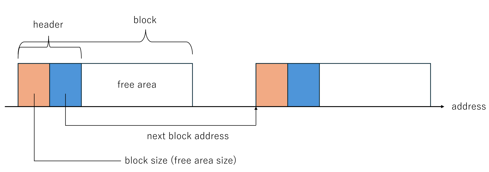
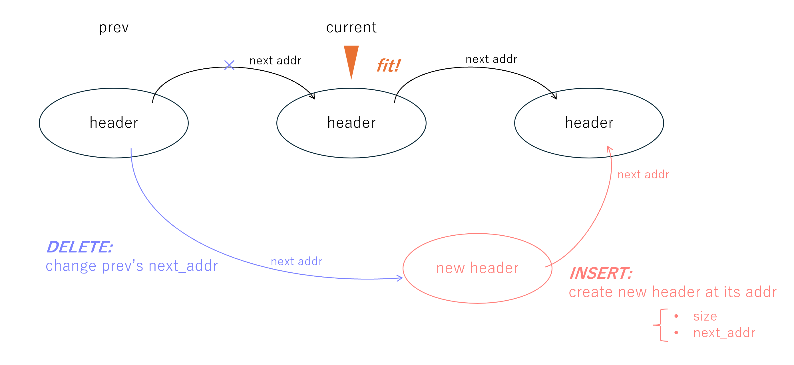
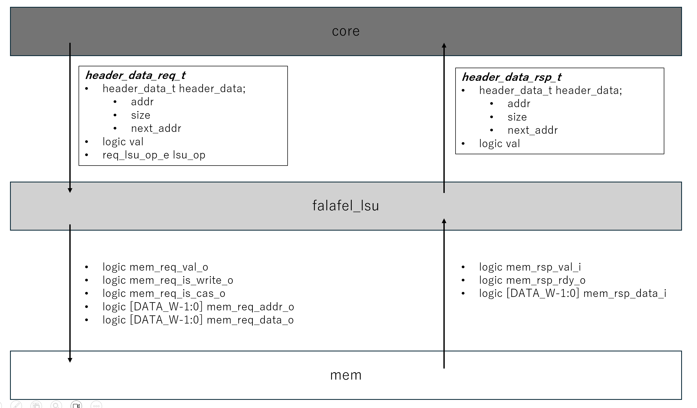
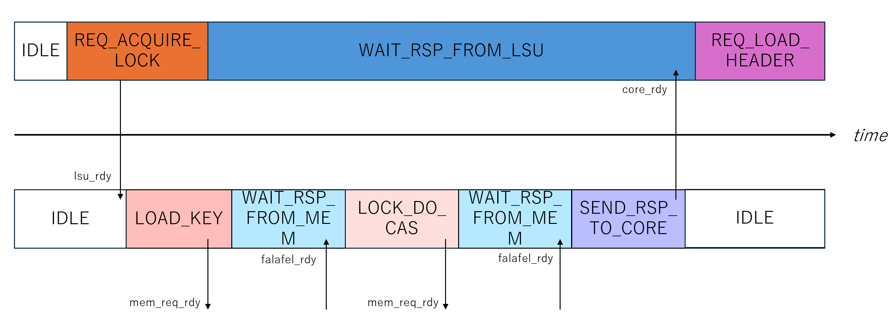
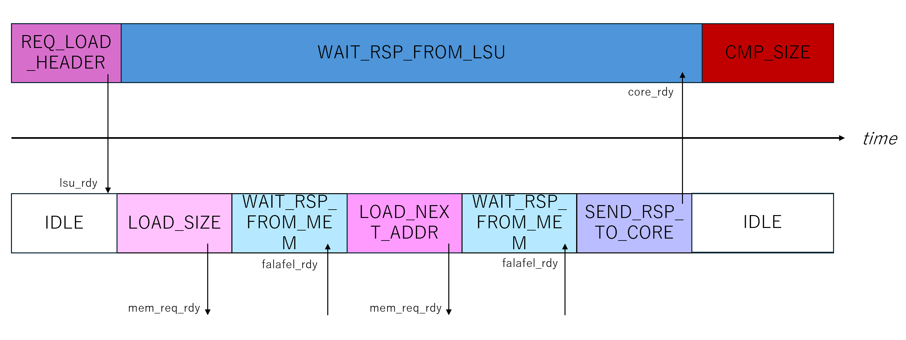
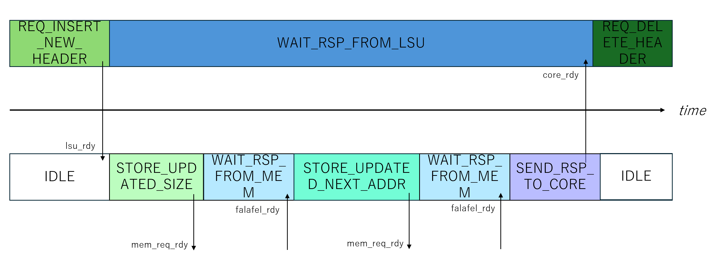
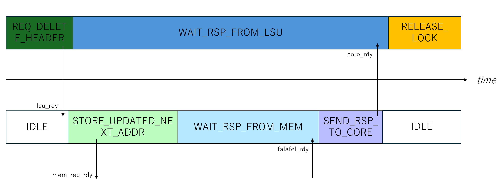
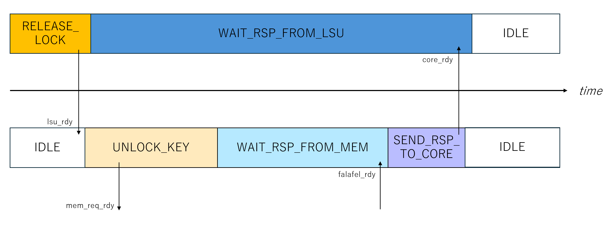

# Falafel v2 document <!-- omit in toc -->
last update: Nov 24, 2024

- [terms](#terms)
- [falafel\_core](#falafel_core)
  - [states](#states)
- [falafel\_lsu](#falafel_lsu)
  - [states](#states-1)
- [interfaces \& interactions between core, lsu and mem](#interfaces--interactions-between-core-lsu-and-mem)

## terms
- [header](#header):  
Falafel v2 uses a linked list structure for managing its free list; the block size of the free block 
The header contains the metadata located at the beginning of each free block; the size of the free block & the address of the next header address  

- header_data:  
the data in the header (block size & next address) + the address of the header
- [insert / delete header](#insert_delete)

## falafel_core
the part responsible for the first-fit or the best-fit algorithm

### states
※　a request to the lsu occurs in the `REQ_*` states  
※　falafel_core can only receive a response from lsu in the `WAIT_RSP_FROM_LSU` state.

- `IDLE`
- `REQ_ACQUIRE_LOCK`: 
    request lock;  
    if the allocator acquire the lock, then it can move to starting the process of its memory allocating
- `REQ_RELEASE_LOCK`:
    release lock after the process of memory allocating
- `REQ_LOAD_HEADER`: cf. [header](#header)
- `CMP_SIZE`
- `REQ_INSERT_NEW_HEADER`: cf. [insert / delete header](#insert_delete)
- `REQ_DELETE_HEADER`: cf. [insert / delete header](#insert_delete)
- `WAIT_RSP_FROM_LSU`

## falafel_lsu
the part responsible for interactions with memory

### states
※　a request to the mem occurs in the `REQ_*` states  
※　falafel_lsu can only receive a response from lsu in the `WAIT_RSP_FROM_MEM` state.

- `IDLE`
- `LOAD_KEY`:  
    request loading the key to the mem (to check whether the lock is open or not at the point)
- `LOCK_DO_CAS`:
    request the lock 
- `UNLOCK_KEY`: request unlocking
- `LOAD_SIZE`:  
    request loading the size of the free block to the mem
- `LOAD_NEXT_ADDR`:  
    request loading the next header address of the free block to the mem
- `STORE_UPDATED_SIZE`:  
    request storing the size of the free block to the mem (setting the updated size of the free block)
- `STORE_UPDATED_NEXT_ADDR`
    request storing the next header address of the free block to the mem (setting te updated next address of the free block)
- `WAIT_RSP_FROM_MEM`
- `SEND_RSP_TO_CORE`

## interfaces & interactions between core, lsu and mem
- the interface overview

- the interactions in each procedure
    - lock:  
    
    - load header:  
    
    - update header: cf. [insert / delete header](#insert_delete)  
    
    - delete header: cf. [insert / delete header](#insert_delete)  
    
    - release lock:  
    