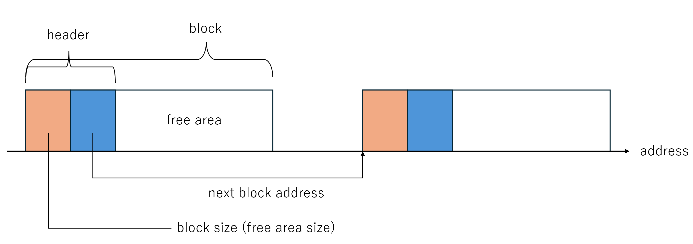

# Documents<!-- omit in toc -->
last update: Dec 10, 2024
- [terms](#terms)
- [mechanisms](#mechanisms)
  - [start processing the req](#start-processing-the-req)
  - [alloc](#alloc)
  - [free](#free)
- [modules](#modules)
  - [falafel](#falafel)
    - [falafel\_core](#falafel_core)
      - [io](#io)
      - [states](#states)
    - [falafel\_lsu](#falafel_lsu)
      - [io](#io-1)
      - [states](#states-1)
- [interfaces \& interactions between core, lsu and mem](#interfaces--interactions-between-core-lsu-and-mem)


## terms
- header: <br>
Falafel v2 uses a linked list structure for managing its free list; <br>
The header contains the header located at the beginning of each free block; the size of the free block & the address of the next header address <br>

<!-- - header_data: <br>
the data in the header (block size & next address) + the address of the header
- [insert / delete header](#insert_delete)
 -->

 ## mechanisms
 ### start processing the req
 - configuration <br>
    before allocation or free requests, the following configuration information needs to be sent to the allocator:

    ```verilog
    logic [DATA_W-1:0] free_list_ptr;  
    // the address of the location storing the address information of the first header of the free list.

    logic [DATA_W-1:0] lock_ptr; 
    // the address to store the lock id. if `EMPTY_KEY` is stored, no process holds the lock.

    logic [DATA_W-1:0] lock_id;  
    // the id assigned to each request allows identification of whether the process for that request holds the lock.
    ```
 - lock <br>
    if `EMPTY_KEY` is stored in `lock_ptr`, the lock can be acquired by storing the request's `lock_id` in `lock_ptr`. <br>
    when the process is completed, store `EMPTY_KEY` in `lock_ptr`.

 - reading the first header of the free list <br>
    reading the data stored in `free_list_ptr` gives the address of the first header of the free list.


 ### alloc
 1. provide the alloc request and the memory size to allocate
 2. acquire lock 
 3. find a fitting location from the free block <br>
    → allocation strategies
    - **first fit** (supported): <br> falafel v2 goes through the linked list of free blocks from the start and searches for the first block of memory that is large enough to satisfy the allocation request
    - **best fit** (supported): <br> falafel v2 goes through the entire linked list of free blocks to find the smallest block of memory that is large enough, aiming to minimize wasted space.
 4. update the linked list of free blocks
    
   
 ### free
  0. provide the free request and the memory size to allocate
  1. acquire lock 
  2. find a proper block to free <br> ※ the linked list of free blocks is sorted in ascending order of memory addresses
  3. update the linked list of free blocks
     1. load the header of the block to be freed (to retrieve the size information)
     2. check if there are neighboring free blocks to the block to be freed
     3. the process varies depending on how free blocks are merged
        - case of a **right** neighbor free block <br>
            
        - case of a **left** neighbor free block
            
        - case of **both** neighbors being free blocks
            
        - case of **no** neighboring free blocks
            

## modules
### falafel
#### falafel_core
the part responsible for the alloc & free strategies

##### io
```verilog
    input logic clk_i,
    input logic rst_ni,

    input alloc_strategy_t config_alloc_strategy_i,
    input config_regs_t falafel_config_i,
    input logic is_alloc_i,
    input logic [DATA_W-1:0] size_to_allocate_i,
    input logic [DATA_W-1:0] addr_to_free_i,
    input logic req_alloc_valid_i,

    output logic core_ready_o,
    input logic lsu_ready_i,
    input header_rsp_t rsp_from_lsu_i,
    output header_req_t req_to_lsu_o,

    input logic result_ready_i,
    output logic rsp_result_val_o,
    output logic rsp_result_is_write_o,
    output logic [DATA_W-1:0] rsp_result_data_o
```
- `config_alloc_strategy_i`: first fit or best fit
- `falafel_config_i`: config on free_list_ptr(), lock_ptr, lock_id
- `is_alloc_i`: alloc request or free request
- `result_ready_i`: whether the systems can receive the result (fit addr or free completion notification) from falafel
- `rsp_result_is_write_o`: alloc result(1) or free result(0)

##### states
I recommend starting with the [mechanisms section](#mechanisms) first :)
<br>

※　a request to the lsu occurs in the `REQ_*` states <br>
※　falafel_core can only receive a response from lsu in the `WAIT_RSP_FROM_LSU` state.

- `IDLE`
- `REQ_ACQUIRE_LOCK`: 
    request lock; <br>
    if the allocator acquire the lock, then it can move to starting the process of its memory allocating
- `REQ_RELEASE_LOCK`:
    release lock after the process of memory allocating
- `REQ_LOAD_HEADER`:
  - `SEARCH`: load header for position searching in alloc & free
  - `FREE_TARGET_HEADER`
  - `FREE_RIGHT_HEADER`
- `ALLOC_SEARCH_POS_FIRST_FIT`: find a fitting location from the free block using first fit strategy
- `ALLOC_SEARCH_POS_BEST_FIT`: find a fitting location from the free block using best fit strategy
- `FREE_SEARCH_POS`: find a proper block to free
- `FREE_CHECK_NEIGHBORS`: check if there are neighboring free blocks to the block to be freed
- `REQ_ADJUST_ALLOCATED_HEADER`
- `REQ_FREE_MERGE_BOTH_SIDES`
- `REQ_FREE_MERGE_RIGHT_HEADER`
- `REQ_FREE_MERGE_LEFT_HEADER`
- `REQ_CREATE_NEW_HEADER`
- `REQ_ADJUST_LINK`
- `WAIT_RSP_FROM_LSU`
- `RETURN_RESULT`

#### falafel_lsu
the part responsible for interactions with memory

##### io
```verilog
    input logic clk_i,
    input logic rst_ni,

    input header_req_t core_req_header_i,
    output header_rsp_t core_rsp_header_o,
    input logic core_rdy_i,
    output logic lsu_ready_o,

    //----------- memory request ------------//
    output logic              mem_req_val_o,       // req valid
    input  logic              mem_req_rdy_i,       // mem ready
    output logic              mem_req_is_write_o,  // 1 for write, 0 for read
    output logic              mem_req_is_cas_o,    // 1 for cas, 0 for write
    output logic [DATA_W-1:0] mem_req_addr_o,      // address
    output logic [DATA_W-1:0] mem_req_data_o,      // write data
    // output logic [DATA_W-1:0] mem_req_cas_exp_o,   // compare & swap expected value, not supported yet

    //----------- memory response ------------//
    input  logic              mem_rsp_val_i,  // resp valid
    output logic              mem_rsp_rdy_o,  // falafel ready
    input  logic [DATA_W-1:0] mem_rsp_data_i  // resp data // different from original falafel
```
- `mem_req_is_cas_o`: set 1 when requesting lock

##### states
※　a request to the mem occurs in the `REQ_*` states <br>
※　falafel_lsu can only receive a response from lsu in the `WAIT_RSP_FROM_MEM` state.


- `IDLE`
- `LOAD_KEY`: <br>
    request loading the key to the mem (to check whether the lock is open or not at the point)
- `LOCK_DO_CAS`:
    request the lock 
- `UNLOCK_KEY`: request unlocking
- `LOAD_SIZE`: <br>
    request loading the size of the free block to the mem
- `LOAD_NEXT_ADDR`: <br>
    request loading the next header address of the free block to the mem
- `STORE_UPDATED_SIZE`: <br>
    request storing the size of the free block to the mem (setting the updated size of the free block)
- `STORE_UPDATED_NEXT_ADDR`: <br>
    request storing the next header address of the free block to the mem (setting te updated next address of the free block)
- `WAIT_RSP_FROM_MEM`
- `SEND_RSP_TO_CORE`

## interfaces & interactions between core, lsu and mem
- the interface overview

- the interactions in each procedure <br>
    → the core specifies the operation it wants to perform to the lsu using `req_lsu_op`
    - req_lsu_op: `LOCK` <br>
    
    - release lock: `UNLOCK` <br>
    
    - req_lsu_op: `LOAD` <br>
    
    - req_lsu_op: `EDIT_SIZE_AND_NEXT_ADDR`  <br>
    
    - req_lsu_op: `EDIT_NEXT_ADDR`: <br>
    
